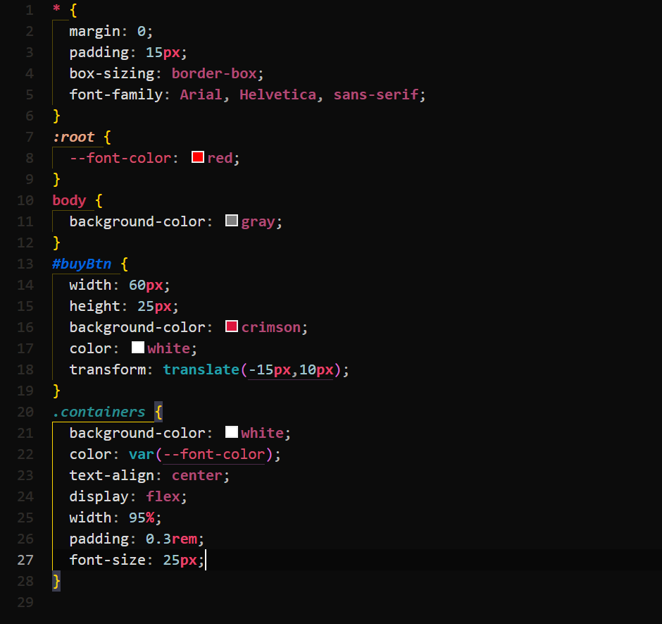

## Midnight Crimson theme

---
1,000+ Downloads 🎉 (March 7, 2025)
---

Introducing the Midnight Crimson theme for Visual Studio Code, a dark mode extension that will enhance your coding experience. This theme features a dark gray background with deep red accents, providing a visually striking and high-contrast appearance that makes your code easy to read. The Midnight Crimson theme also includes shades of white and light gray for better legibility of the code. This theme is perfect for those looking for a sleek, modern look while keeping their code organized and easy to read. Give your code a touch of mystery and intensity with Midnight Crimson.
**Example of html file:**

**Example of css file:**

**Example of javascript file:**

*Took the inspiration from the dark horizon theme:*
*https://github.com/mcagampan/dark-horizon*

Feel free to edit the theme for your own liking.
